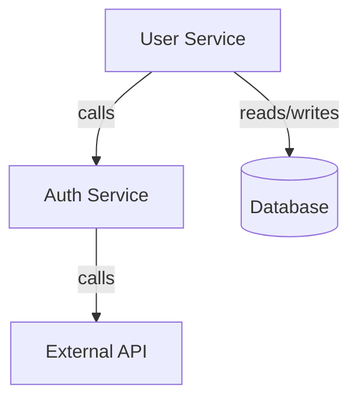

# HIRO: Architecture Intelligence Platform
## System Design Document

---

## Product Overview

HIRO is an AI-powered architecture intelligence platform that automatically generates and maintains live architecture diagrams from codebases. By continuously synchronizing with Git commits, HIRO eliminates manual documentation overhead and reduces developer onboarding time from weeks to minutes.

**Core Problem:**
Developers waste significant time understanding unfamiliar codebases. Traditional documentation becomes outdated quickly, and manual architecture diagrams require constant maintenance.

**HIRO Solution:**
Automatic architecture extraction and visualization that stays synchronized with code changes. Developers get instant, accurate understanding of system structure without reading thousands of lines of code.

**Key Benefits:**
- Zero manual documentation effort
- Always up-to-date architecture views
- Instant onboarding for new team members
- AI-powered insights into code structure
- Real-time updates on every commit

---

## High-Level Architecture

HIRO follows a layered architecture with clear separation of concerns:

```
┌──────────────────────────────────────────────────────┐
│              Frontend Layer (Next.js)                │
│     Interactive UI • React Flow Diagrams • Export    │
└──────────────────────────────────────────────────────┘
                        ↕ HTTP/WebSocket
┌──────────────────────────────────────────────────────┐
│           Backend API Layer (Node.js/Express)        │
│      REST Endpoints • WebSocket Server • Auth        │
└──────────────────────────────────────────────────────┘
                        ↕
        ┌───────────────┴────────────────┐
        ↓                                ↓
┌──────────────────┐          ┌──────────────────────┐
│  Parsing Engine  │          │  AI Intelligence     │
│  Babel AST       │          │  Ollama / OpenAI     │
│  TS Compiler API │          │  Architecture        │
└──────────────────┘          │  Analysis            │
        ↓                     └──────────────────────┘
┌──────────────────┐                    ↓
│  Job Queue       │          ┌──────────────────────┐
│  BullMQ          │          │  PostgreSQL          │
└──────────────────┘          │  Architecture Store  │
        ↓                     └──────────────────────┘
┌──────────────────┐
│  Git Integration │
│  GitHub API      │
│  Webhooks        │
└──────────────────┘
```

### Architecture Flow

**Input Layer:**
Repository URL → Git clone → File system scan

**Parsing Layer:**
Source files → AST generation → Dependency extraction

**AI Intelligence Layer:**
Parsed data → Component classification → Relationship inference

**Visualization Layer:**
Architecture data → React Flow rendering → Interactive diagram

**Output Layer:**
Live diagram → Export formats → Real-time updates

---

## Core System Components

### 1. Repository Scanner

**Purpose:** Discover and catalog all relevant code files in a repository.

**Responsibilities:**
- Recursive directory traversal
- Apply .gitignore patterns
- Identify entry points (main.js, index.ts, server.js)
- Detect configuration files (package.json, tsconfig.json)
- Filter out build artifacts and dependencies

**Implementation:**
```typescript
interface RepositoryScanner {
  scanRepository(path: string): Promise<FileTree>;
  applyIgnorePatterns(files: FileTree): FileTree;
  identifyEntryPoints(files: FileTree): EntryPoint[];
}
```

**Performance:**
- Parallel directory scanning
- Early termination for ignored paths
- Stream-based file reading

### 2. Parsing Engine

**Purpose:** Extract structured information from source code using Abstract Syntax Trees.

**Responsibilities:**
- Parse JavaScript files with Babel AST
- Parse TypeScript files with TS Compiler API
- Extract imports and exports
- Identify function calls and class definitions
- Detect API routes and database queries
- Build dependency graph

**Implementation:**
```typescript
interface ParsingEngine {
  parseFile(path: string, content: string): Promise<ParseResult>;
  extractImports(ast: ASTNode): Import[];
  extractExports(ast: ASTNode): Export[];
  extractRoutes(ast: ASTNode): Route[];
  buildDependencyGraph(results: ParseResult[]): DependencyGraph;
}
```

**Key Features:**
- Handles both CommonJS and ES Modules
- Supports JSX and TSX syntax
- Detects Express/Fastify routes
- Identifies database ORM calls
- Caches AST for unchanged files

### 3. Architecture Intelligence Engine

**Purpose:** Transform parsed code into architectural insights using AI.

**AI Models:**
- **Development:** Ollama (local, no API costs)
- **Production:** OpenAI GPT-4 (higher accuracy)

**Responsibilities:**
- Classify components (services, APIs, databases, modules)
- Infer relationships between components
- Detect architectural patterns
- Identify performance risks
- Analyze security paths
- Process natural language search queries

**Implementation:**
```typescript
interface ArchitectureIntelligence {
  classifyComponent(parseData: ParseResult): Promise<Component>;
  inferRelationships(graph: DependencyGraph): Promise<Relationship[]>;
  detectRisks(components: Component[]): Promise<Risk[]>;
  searchComponents(query: string, components: Component[]): Promise<SearchResult[]>;
}
```

**AI Prompt Strategy:**
```
Input: Parsed code structure (imports, exports, routes, DB calls)
Task: Classify component type and identify relationships
Output: Structured JSON with component metadata
```

**Configuration:**
- Temperature: 0.2 (consistent results)
- Max tokens: 2048
- Retry logic: Exponential backoff
- Timeout: 30 seconds

### 4. Diagram Generator

**Purpose:** Create interactive visual representations of architecture.

**Visualization Stack:**
- **React Flow:** Interactive node-based diagrams
- **Mermaid.js:** Exportable diagram format

**Node Types:**
- Service nodes (backend APIs)
- Database nodes (PostgreSQL, MongoDB, etc.)
- External API nodes (third-party services)
- Module nodes (internal libraries)
- Frontend nodes (UI components)

**Edge Types:**
- Solid lines: Direct function calls
- Dashed lines: Async operations
- Thick lines: High-frequency calls
- Colored edges: Data flow direction

**Implementation:**
```typescript
interface DiagramGenerator {
  generateDiagram(components: Component[], relationships: Relationship[]): DiagramData;
  applyLayout(algorithm: 'hierarchical' | 'force'): void;
  exportToMermaid(diagram: DiagramData): string;
}
```

**Layout Algorithms:**
- Hierarchical: Top-down service layers
- Force-directed: Organic clustering

### 5. Real-Time Sync Engine

**Purpose:** Keep architecture diagrams synchronized with Git commits.

**Workflow:**
1. Developer pushes commit to GitHub
2. GitHub webhook triggers HIRO backend
3. Backend validates webhook signature
4. Git integration fetches commit diff
5. BullMQ queues incremental analysis job
6. Parsing engine analyzes changed files only
7. AI engine updates affected components
8. New architecture snapshot stored in PostgreSQL
9. WebSocket broadcasts update to connected clients
10. Frontend applies incremental changes with animation

**Implementation:**
```typescript
interface RealTimeSyncEngine {
  registerWebhook(repoUrl: string): Promise<void>;
  handleWebhook(payload: GitHubWebhook): Promise<void>;
  analyzeIncremental(changedFiles: string[]): Promise<DiagramUpdate>;
  broadcastUpdate(update: DiagramUpdate): void;
}
```

**WebSocket Events:**
- `diagram_update`: New architecture available
- `analysis_progress`: Job progress (0-100%)
- `error`: Analysis failure

### 6. Export Engine

**Purpose:** Generate architecture diagrams in multiple formats for documentation.

**Supported Formats:**
- PowerPoint (PPT/PPTX)
- PDF documents
- PNG images
- SVG vector graphics
- Mermaid.js source code

**Implementation:**
```typescript
interface ExportEngine {
  exportToPPT(diagram: DiagramData): Promise<Buffer>;
  exportToPDF(diagram: DiagramData): Promise<Buffer>;
  exportToPNG(diagram: DiagramData): Promise<Buffer>;
  exportToSVG(diagram: DiagramData): Promise<string>;
  exportToMermaid(diagram: DiagramData): string;
}
```

**Export Features:**
- Preserves diagram layout
- Includes metadata (commit hash, timestamp)
- High-resolution output
- Customizable styling

---

## Data Flow

### Initial Repository Analysis

```
User connects repository
    ↓
Backend clones repository via Git API
    ↓
Repository Scanner discovers files
    ↓
BullMQ queues analysis job
    ↓
Parsing Engine generates AST for each file
    ↓
Parsing Engine extracts:
  • Imports/exports
  • Function calls
  • API routes
  • Database queries
    ↓
Dependency Graph Builder creates graph
    ↓
AI Intelligence Engine analyzes graph
    ↓
AI generates:
  • Component classifications
  • Relationship inferences
  • Risk assessments
    ↓
Diagram Generator creates visualization
    ↓
PostgreSQL stores architecture snapshot
    ↓
WebSocket pushes diagram to frontend
    ↓
React Flow renders interactive diagram
```

### Live Git Synchronization

```
Developer commits code to GitHub
    ↓
GitHub webhook triggers HIRO
    ↓
Backend validates webhook signature
    ↓
Git Integration fetches commit diff
    ↓
Diff Analyzer identifies changed files
    ↓
BullMQ queues incremental analysis
    ↓
Parsing Engine analyzes changed files only
    ↓
AI Engine updates affected components
    ↓
Backend compares with previous version
    ↓
PostgreSQL stores new snapshot
    ↓
WebSocket broadcasts incremental update
    ↓
Frontend applies changes with animation
```

### Search and Navigation

```
User enters natural language query
    ↓
Frontend sends query to backend
    ↓
AI Engine processes query semantically
    ↓
AI matches query to components
    ↓
Backend returns ranked results
    ↓
Frontend highlights matching components
    ↓
User clicks component
    ↓
Frontend highlights all connections
```

---

## Real-Time Update Strategy

### WebSocket Architecture

**Connection Protocol:**
1. Client connects with repository ID
2. Server subscribes client to repository channel
3. Server broadcasts updates to all subscribed clients
4. Client receives incremental updates
5. React Flow applies changes smoothly

**Message Format:**
```typescript
interface WebSocketMessage {
  type: 'diagram_update' | 'analysis_progress' | 'error';
  timestamp: Date;
  payload: {
    repositoryId: string;
    commitHash: string;
    changes: {
      added: Node[];
      removed: string[];
      modified: Node[];
    };
  };
}
```

**Optimization:**
- Send only incremental changes, not full diagrams
- Compress messages for large updates
- Batch multiple changes
- Implement reconnection logic

### Git Webhook Integration

**Webhook Setup:**
```typescript
// Register webhook with GitHub
await github.repos.createWebhook({
  owner,
  repo,
  config: {
    url: `${BACKEND_URL}/api/webhooks/github`,
    content_type: 'json',
    secret: WEBHOOK_SECRET
  },
  events: ['push']
});
```

**Webhook Handler:**
```typescript
app.post('/api/webhooks/github', async (req, res) => {
  // Verify signature
  const signature = req.headers['x-hub-signature-256'];
  if (!verifySignature(req.body, signature)) {
    return res.status(401).send('Invalid signature');
  }
  
  // Queue analysis
  const { repository, commits } = req.body;
  await analysisQueue.add('incremental-analysis', {
    repositoryId: repository.id,
    changedFiles: extractChangedFiles(commits)
  });
  
  res.status(200).send('OK');
});
```

---

## Visualization Strategy

### React Flow Implementation

**Interactive Features:**
- Zoom and pan navigation
- Drag nodes to reposition
- Hover for component details
- Click to highlight connections
- Search to focus on components

**Node Rendering:**
```typescript
function ServiceNode({ data }: NodeProps) {
  return (
    <div className="service-node">
      <div className="header">
        <Icon type={data.type} />
        <span>{data.name}</span>
      </div>
      <div className="body">
        <div className="tech">{data.technologies.join(', ')}</div>
        <div className="routes">{data.routes.length} endpoints</div>
      </div>
      {data.risks.length > 0 && (
        <div className="risk-badge">{data.risks.length}</div>
      )}
    </div>
  );
}
```

**Performance Optimizations:**
- Virtual rendering for large diagrams (>500 nodes)
- Level-of-detail rendering (hide labels when zoomed out)
- Edge bundling for dense connections
- Lazy loading of node details
- Debounced pan/zoom handlers

### Mermaid.js Export

**Format:**


**Export Implementation:**
```typescript
function exportToMermaid(diagram: DiagramData): string {
  let mermaid = 'graph TD\n';
  
  diagram.nodes.forEach(node => {
    const shape = getNodeShape(node.type);
    mermaid += `  ${node.id}${shape}${node.data.name}${shape}\n`;
  });
  
  diagram.edges.forEach(edge => {
    mermaid += `  ${edge.source} -->|${edge.type}| ${edge.target}\n`;
  });
  
  return mermaid;
}
```

---

## Deployment Architecture

### Docker Configuration

**Services:**
- **Frontend:** Next.js application (port 3000)
- **Backend:** Node.js API server (port 4000)
- **Worker:** BullMQ job processor
- **Database:** PostgreSQL 15
- **Cache:** Redis 7

**Docker Compose:**
```yaml
version: '3.8'

services:
  frontend:
    build: ./frontend
    ports:
      - "3000:3000"
    environment:
      - NEXT_PUBLIC_API_URL=http://backend:4000
      - NEXT_PUBLIC_WS_URL=ws://backend:4000

  backend:
    build: ./backend
    ports:
      - "4000:4000"
    environment:
      - DATABASE_URL=postgresql://postgres:password@db:5432/hiro
      - REDIS_URL=redis://redis:6379
      - OPENAI_API_KEY=${OPENAI_API_KEY}

  worker:
    build: ./backend
    command: npm run worker
    environment:
      - DATABASE_URL=postgresql://postgres:password@db:5432/hiro
      - REDIS_URL=redis://redis:6379

  db:
    image: postgres:15
    volumes:
      - postgres_data:/var/lib/postgresql/data

  redis:
    image: redis:7
    volumes:
      - redis_data:/data

volumes:
  postgres_data:
  redis_data:
```

### AWS Deployment

**Infrastructure:**

**Frontend:**
- AWS Amplify (Next.js hosting)
- CloudFront CDN
- Route 53 DNS

**Backend:**
- ECS Fargate (containerized API)
- Application Load Balancer
- Auto-scaling: 2-10 instances

**Workers:**
- ECS Fargate (BullMQ workers)
- Queue-based auto-scaling: 1-20 workers

**Database:**
- RDS PostgreSQL (Multi-AZ)
- Automated backups
- Read replicas

**Cache:**
- ElastiCache Redis (Cluster mode)
- Automatic failover

**Storage:**
- S3 (diagram exports, cached AST)
- Lifecycle policies

**Monitoring:**
- CloudWatch Logs
- CloudWatch Metrics
- X-Ray distributed tracing
- SNS alerts

**Scaling Strategy:**
- Frontend: Traffic-based auto-scaling
- Backend: CPU/memory-based scaling
- Workers: Queue depth-based scaling
- Database: Vertical scaling + read replicas

---

## Database Schema

```sql
-- Repositories
CREATE TABLE repositories (
  id UUID PRIMARY KEY,
  user_id UUID NOT NULL,
  name VARCHAR(255) NOT NULL,
  url TEXT NOT NULL,
  webhook_id VARCHAR(100),
  created_at TIMESTAMP DEFAULT NOW()
);

-- Architecture versions
CREATE TABLE architecture_versions (
  id UUID PRIMARY KEY,
  repository_id UUID REFERENCES repositories(id),
  commit_hash VARCHAR(40) NOT NULL,
  diagram_data JSONB NOT NULL,
  created_at TIMESTAMP DEFAULT NOW()
);

-- Components
CREATE TABLE components (
  id UUID PRIMARY KEY,
  version_id UUID REFERENCES architecture_versions(id),
  name VARCHAR(255) NOT NULL,
  type VARCHAR(50) NOT NULL,
  metadata JSONB
);

-- Relationships
CREATE TABLE relationships (
  id UUID PRIMARY KEY,
  version_id UUID REFERENCES architecture_versions(id),
  from_component_id UUID REFERENCES components(id),
  to_component_id UUID REFERENCES components(id),
  type VARCHAR(50) NOT NULL
);

-- Risks
CREATE TABLE risks (
  id UUID PRIMARY KEY,
  version_id UUID REFERENCES architecture_versions(id),
  component_id UUID REFERENCES components(id),
  severity VARCHAR(20) NOT NULL,
  category VARCHAR(50) NOT NULL,
  description TEXT NOT NULL
);
```

---

## API Endpoints

### Repository Management
```
POST   /api/repositories
GET    /api/repositories/:id
DELETE /api/repositories/:id
```

### Analysis
```
POST   /api/repositories/:id/analyze
GET    /api/repositories/:id/status
GET    /api/repositories/:id/diagram
```

### Search
```
GET    /api/repositories/:id/search?q=query
```

### Export
```
POST   /api/repositories/:id/export
Body: { format: 'ppt' | 'pdf' | 'png' | 'svg' | 'mermaid' }
```

### History
```
GET    /api/repositories/:id/history
GET    /api/repositories/:id/diff?from=hash&to=hash
```

### Webhooks
```
POST   /api/webhooks/github
```

### WebSocket
```
WS     /ws
```

---

## Technology Stack

**Frontend:**
- Next.js 14
- React 18
- React Flow 11
- TailwindCSS
- Socket.io-client

**Backend:**
- Node.js 20
- Express 4
- BullMQ 4
- Socket.io

**Parsing:**
- @babel/parser
- @babel/traverse
- TypeScript Compiler API

**AI:**
- Ollama (development)
- OpenAI SDK (production)

**Database:**
- PostgreSQL 15
- Redis 7

**DevOps:**
- Docker
- AWS ECS
- AWS RDS
- AWS Amplify

---

## Security Considerations

**API Key Protection:**
- Encrypted storage in PostgreSQL
- Environment variables for deployment
- Never logged or exposed

**Repository Access:**
- OAuth tokens with minimal scopes
- Webhook signature verification
- Rate limiting

**Data Privacy:**
- Store metadata only, not source code
- Support self-hosted deployment
- Data retention policies

**Network Security:**
- HTTPS for all communications
- CORS policies
- WebSocket authentication

---

## Performance Optimizations

**Parsing:**
- Parallel file processing
- AST caching
- Incremental analysis

**AI:**
- Batch requests
- Response caching
- Request deduplication

**Database:**
- Connection pooling
- Query optimization
- JSONB indexing

**Frontend:**
- Virtual rendering
- Lazy loading
- Debounced interactions

**Real-Time:**
- Incremental updates
- Message compression
- Binary protocols
